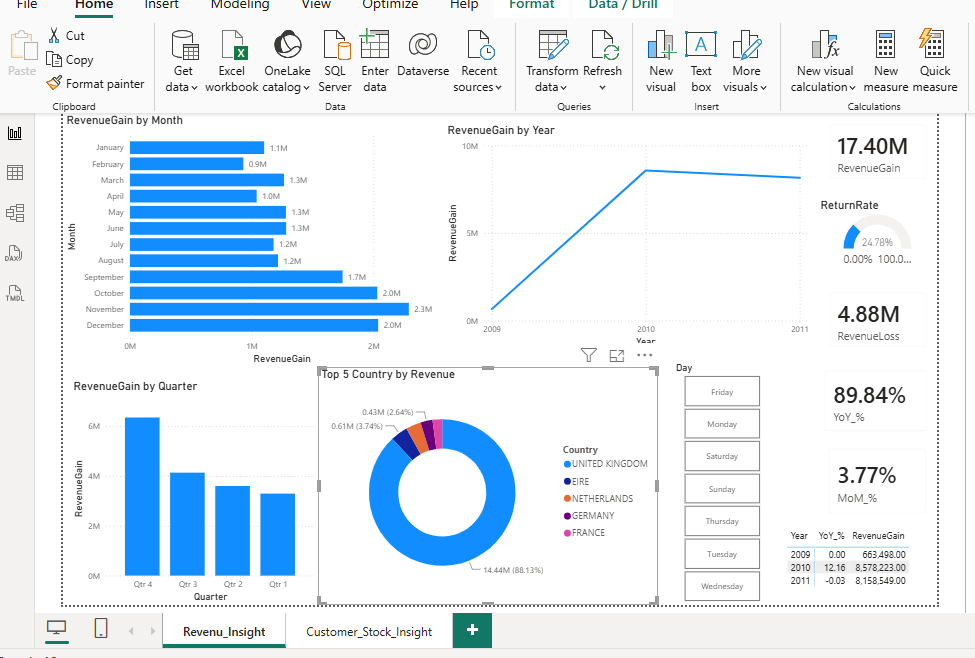
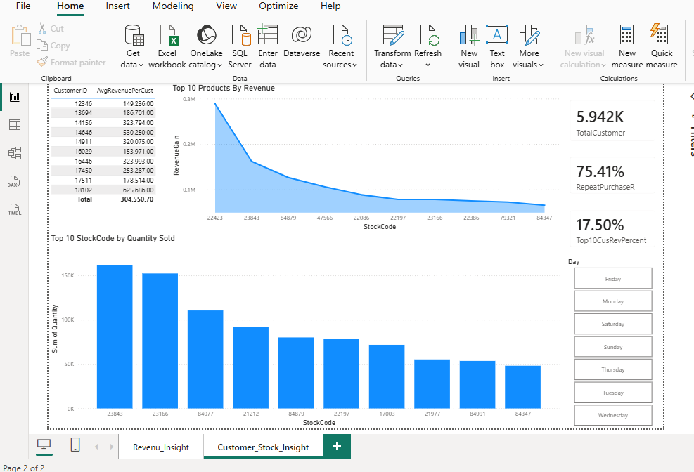

# E-commerce-Revenue-and-Customer-Analytics-Using-SQL-and-Power-BI

This project analyzes an online++retail++ii data to identify revenue trend, customer behavior, product performance and the impact of product returns on overall business performance. 
The goal was to transform raw transactional data into actionable insights that can help business decision-making in sales, inventory planning, revenue optimization and customer retension.
Tools Used: 
* SQL Server Management Studio (SSMS)
* Power BI
* DAX
Data Preparation
The dataset was cleaned and prepared using SQL Server.
Key data preparation activities included:
* Handling Blank Cells
* Removing Duplicates
* Standardizing transaction fields
* Creating Business metrics
* preparing data for dashboard reporting

Dashboard Pages
Revenue_Insight
Provides visibility into:
* Revenue trends over time
* Quarterly performance
* Country-level revenue contribution
* Month-over-Month (MoM) growth
* Year-over-Year (YoY) growth
* Revenue gains and losses
* Return rate analysis

Customer_Stock_Insight
Provides visibility into:
* Customer purchasing behavior
* Repeat customer analysis
* Top-performing customers
* Product demand analysis
* Stock performance
  
Key Findings
Revenue Performance:
* Q4 generated the highest revenue, indicating strong seasonal demand.
* The United Kingdom contributed the highest revenue among all countries analyzed.

Customer Behavior:
* 75.41% of customers placed multiple orders during the analysis period, demonstrating strong customer retention and repeat purchasing behavior.
* Customer 18102 generated the highest revenue among all customers.
Product Performance:
* Stock Code 23843 was the most purchased product.

Returns Analysis:
* The return rate was 24.7%, indicating a significant source of revenue leakage and an opportunity for operational improvement.
  
Revenue Distribution:
* The top 10 customers generated 17.5% of total revenue, suggesting revenue is distributed across a broad customer base rather than being concentrated among a small number of customers.
  
Business Recommendations:
* Increase marketing investment during Q4 to capitalize on seasonal purchasing patterns.
* Prioritize customer retention strategies because repeat customers represent a significant portion of the customer base.
* The return rate stands at 24.7%, causing a estimated revenue loss of 4.88 Million Pounds. A 5% reduction in returns through stricter supplier quality control in the UK region would reclaim 244,000 pounds in lost profit margin.  
* StockCode 23843 is the primary volume driver. I recommend establishing a safety trigger point of X units 45 days prior to Q4 to prevent out-of-stock scenarios durink peak seasonal demand.
* Continue investing in broad customer acquisition since revenue is not overly dependent on a few customers.
